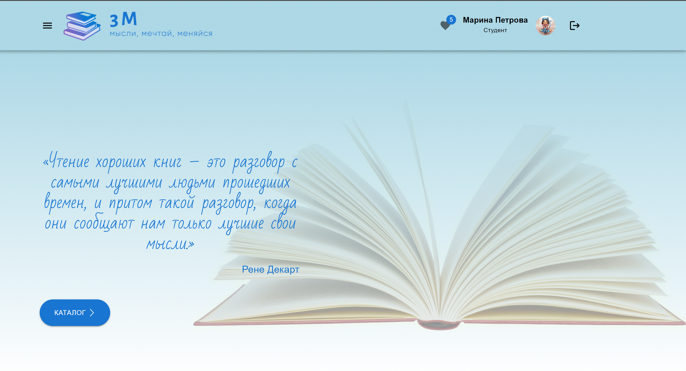

# "3М"

## О проекте

Данный проект является итоговой работой по процессу обучения в СберУниверситете. В нем мы попытались использовать полученные знания как в ходе обучения, так и полученные самостоятельно.

## О концепции

В современном цифровом мире  порой так хочется выключить все гаджеты и побыть в "тишине". Взять в руки хорошую книгу, завернуться в плед и за чашкой горячего чая окунуться в другой мир. Наш сайт будет отличным помощником в этом. Здесь вы найдете краткое описание книги, сможете оставить свой комментарий к книге и составить личную коллекцию понравившихся книг.

## Стек технологий

React JS\
Material UI

## Запуск проекта

Для установки зависимостей выполнить команду
npm i

npm start

## Команда

Петрова Марина <https://github.com/zayssa>
Картмазова Маргарита <https://github.com/kartmazova-m>
